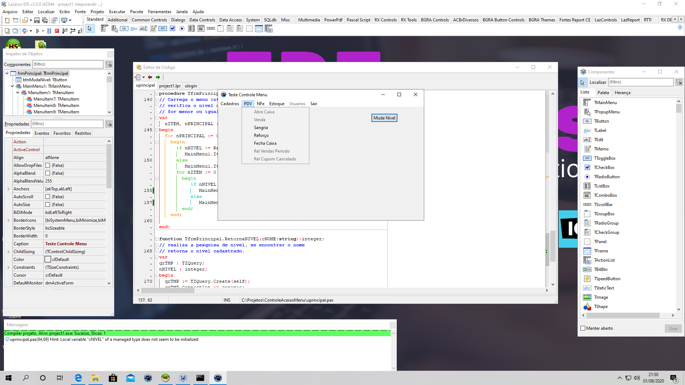

# LAZARUS - Controle de Acesso a Nivel de Usuário
### PROGRAMA: Controle de acesso aos itens do menu

# IDE LAZARUS

### Autor: Daniel de Morais (https://www.youtube.com/user/infocotidiano/)

Exemplo de como criar um controle de acesso aos itens do menu através de nivel do usuario.
vamos precisar de duas tabelas (nivel e usuario) 

#Atenção: existe um arquivo "funcoes.txt" que além das funções prontas, contém a estrutura das duas tabelas

###Link para o meu video: (https://youtu.be/qeXXtp9yjlY e https://youtu.be/VHY6GFd-MSY)
